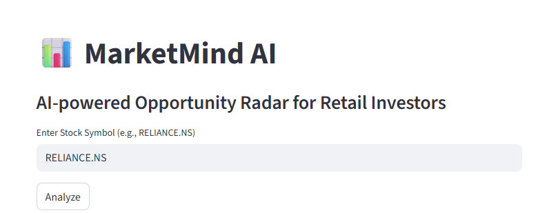
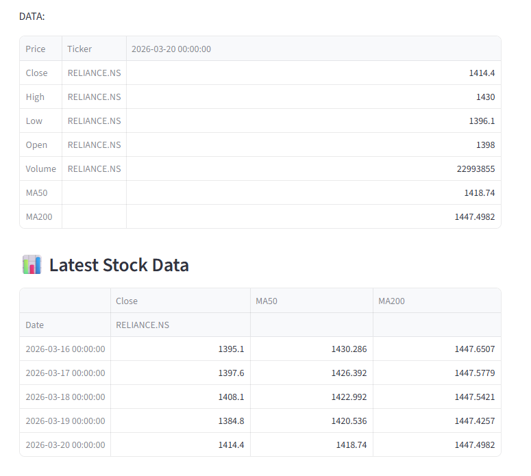
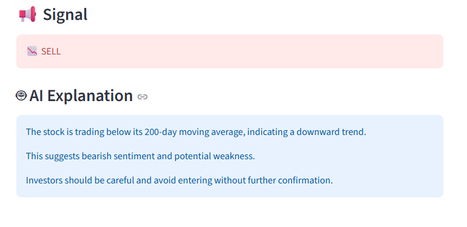

# 📊 MarketMind AI – GenAI-powered Opportunity Radar for Retail Investors

AI-powered Opportunity Radar for Retail Investors that helps retail investors understand market trends using simple explanations instead of complex data.

---

## 📸 Demo



---

## 🚨 Problem
Retail investors struggle to interpret stock data due to:

- Complex charts  
- Financial jargon  
- Misinformation  

---

## 💡 Solution
MarketMind AI:

- Fetches real-time stock data  
- Calculates key indicators (MA50, MA200)  
- Generates BUY/SELL signals  
- Uses Generative AI to explain decisions in simple language  

---

## 🧠 Why GenAI?
MarketMind AI acts as an Opportunity Radar by not just identifying signals, but explaining their significance and relevance to retail investors in real time.

---

## ⚙️ Tech Stack
- Python  
- Streamlit  
- yfinance  
- OpenAI API  

---

## ▶️ How to Run

### 1. Clone the repository
```bash
git clone https://github.com/royg-collab/marketmind-ai.git
cd marketmind-ai
```

### 2. Install dependencies

```bash
pip install -r requirements.txt
streamlit run app.py
```

---

## 📌 Sample Input
Try:
- RELIANCE.NS  
- TCS.NS  
- INFY.NS  

---

## 📊 What You Will See
- Latest stock data
- 

- BUY/SELL signal  
- AI-generated explanation
- 


---


## ⚠️ Disclaimer
This tool is for educational purposes only and does not provide financial advice.

---

## 📄 Additional Documents
- Architecture: ARCHITECTURE.md  
- Impact Model: IMPACT.md  
